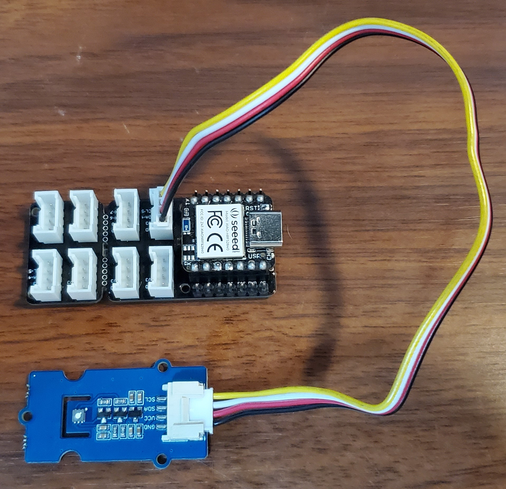

# Testing the Nordic nPM1100 use cases

All the use cases will be made with the same board of the prototype of the [EKG](https://github.com/EddOliver/Nordic-npm) to truly carry out a comparison of consumption between projects with the same board but different software and components.

The board that we will be using is the [XIAO Board](https://www.seeedstudio.com/Seeed-XIAO-BLE-nRF52840-p-5201.html) since it contains an nRF52840 chip and is very suitable for prototyping thanks to its compatibility with ArduinoIDE.

Within the official documentation they indicate how to read the current consumption of the nPM with the PPKII.

[Nordic Official Documentation](https://infocenter.nordicsemi.com/index.jsp?topic=%2Fug_npm1100_ek%2FUG%2FnPM1100_EK%2Fppk2_current_measurement.html)

# EKG:

## Summary:

This is the connection diagram of the components separately from the circuit if you want to do it in a modular way with these pieces, however, a PCB will be made soon with all the components on it on part 3 of this series.

- Communication with the ECG is done through the SPI protocol, unlike other more economical modules such as the AD8232 that are handled with analog readings and occupy an ADC.
- The power that we are supplying with the nPM1100 EK is 3v, which is the maximum voltage that the EK supplies.

Basically, through the nRF gateway and cloud we get the signals from our microcontroller, we clean it a bit and then send it to our dashboard.

The EK configuration is as follows.

## Connection Diagram:

To use the device, an ECG cable connected to the arms was connected to the ECG module, which has a Jack input, later this through BLE sends the data at a frequency of 100Hz to the app to be able to visualize a coherent graph.

Due to the fact that this is a device that we are going to be using for long periods of time and it is also a device that must be used every day, we can understand that the use of disposable electrodes is not feasible. So that's why we decided to make our own dry electrodes.

Materials:

- Copper Plate.
- Silver Conductive Ink.
- Electrode External Snap.

## Electrode arrangement
In order to read the EKG and also make the device as comfortable as possible, we take into consideration the arrangement of Electrodes of the AppleWatch

CR Apple Computers

First we place two electrodes on the right hand and one on the left hand as follows.

Right:

Left:

Ground:

With this arrangement of electrodes we can obtain an ECG signal that while not perfect, we can fix with a little processing.

## BLE Service:

All ECG information is sent at a frequency of 100Hz to the device that is connected to it.

- BLE Service:
  - Name: ECG
  - UUID: 0x2a37
  - BLE Characteristic:
    - UUID: 0x2a37
    - Properties:
      - Read
      - Notify
    - Value:
      - 8-bit unsigned int.

## Power consumption:

- Connection of the POC to the PPKII in Ampere Meter mode.

- Device measurements, we have peaks of 20mA due to the reading of the ECG data every 10ms.

- Here is a 2 min consumption test.

## Proof of Concept:

Finally we put everything in a 3D printed case for the moment so we can test it.

Here is a video demo:

# Illegal Logging and Fire Detector:

## Summary:

For this second use case, we decided to make the [Illegal Logging and Fire Detector](https://www.hackster.io/468821/illegal-logging-and-fire-detector-199e75) which is a project that integrates AI and LoRaWAN, due to the current success of the EdgeImpulse and Helium Network platform, we found it very appropriate to observe the energy consumption of an application with this technology implemented.

## Connection Diagram:

The EK configuration is as follows.

## TVOC Sensor:

This sensor, in addition to measuring the eCO2 of the environment, provides us with the TVOC, which to summarize is a sensor that measures the amount of particles that can be harmful to humans if they are in the air, our advantage is that by being an air quality sensor, we can use it as a smoke presence sensor, since it usually contains many particles that are not "respirable" therefore, when obtaining a high reading of them, it can indicate a fire.

NOTE: the following demo was carried out in controlled situations, starting a fire can be dangerous if proper care is not taken, we do not encourage at any time to carry out these tests without supervision.

Sensor - ILD
Here is a video demo:

## Edge Impulse:

Thanks to the EdgeImpulse platform and our analog microphone, we were able to build an AI model that would allow us to differentiate between the human voice, a chainsaw, and ambient sound.

The original model is published in the following link.

https://studio.edgeimpulse.com/public/82691/latest

Also the inference model for the XIAO if you want to load it directly through ArduinoIDE.

[MODEL](./Illegal%20Logging%20and%20Fire%20Detector/XIAO_inferencing)

The microphone is connected to the A1 input on our board for easy connection via a Grove cable.

NOTE: It is highly recommended that instead of using an analog microphone like this you use a [PDM](https://wiki.seeedstudio.com/Grove-Analog-Microphone/) microphone, since it is much more sensitive, it is possible Obtain data with much higher quality and much lower energy consumption.

Edge - ILD
Here is a video demo:

## Helium LoRaWAN:

For the communication of this device with the world, we will use LoRaWAN, a low energy protocol that has been very popular in recent years, even more so with the extension of The module was used[Helium Network](https://www.helium.com/).

The [LoRa E5 Grove ](https://www.seeedstudio.com/Grove-LoRa-E5-STM32WLE5JC-p-4867.html) module was used to easily connect with our XIAO board.

This is aFinally we will review the current consumption of the entire system with the battery in the course of 3 min, which will indicate the levels that we will be handling. demo video of how we send data from our device to the Helium Console.

Lora - ILD
Here is a video demo:

## Power consumption:

Finally we will review the current consumption of the entire system with the battery in the course of 3 min, which will indicate the levels that we will be handling.

The base consumption of the device over time is 65mAh and with a peak of 180mAh when the data is sent via LoRaWAN.

All the data obtained by the PPKII will be obtained from the following link.

[PPKII Data](./Illegal%20Logging%20and%20Fire%20Detector/ppk-data-logger.ppk)

And all the collection of this data is documented in the following video.

Here is a video demo:

PPKII - ILD

# AgroNordic:

## Summary:

For this third use case, we decided to carry out the project [Agro Nordic](https://www.hackster.io/Edoliver/agronordic-69949d) which is a project that integrates device communication through BLE.

## Connection Diagram:

The EK configuration is as follows.

## Soil Moisture Sensor:

First when monitoring a plant it is very important to know if it has the correct level of moisture, so it was clear that the first sensor we had to include was the [Soil Moisture] sensor (https://wiki.seeedstudio.com/Grove- Moisture_Sensor/)

This sensor is very easy to use, since it is only necessary to read the analog input that the sensor gives us. We include a demo of how the sensor works when submerged in a liquid medium.

Moisture - AgroNordic
Here is a video demo:

## Temperature and Humidity:

In the monitoring of plants, but when there are plants that are very sensitive to changes in humidity and temperature, it is necessary to have a reliable sensor that can monitor these changes, so we use the sensor [SHT40](https://wiki. seeedstudio.com/Grove-SHT4x/).

This sensor works through i2c, however there is already a library compatible with the XIAO board, so this allowed us to use the sensor without major complications. 

[Arduino Library.](https://github.com/Sensirion/arduino-i2c-sht4x)

As in the previous sensor, we show the video of a mini-demo of the sensor working.

SHT40 - AgroNordic
Here is a video demo:

## BLE Connectivity:

The last consideration of this project is to use little energy, so the use of BLE as a means of communication to any BLE gateway was essential.

The configuration of the BLE that we made so that this project could communicate properly was the following.This communication is shown working thanks to the BLE Nordic software.

- BLE Service:
  - Name: AgroNordic
  - UUID: 181A
  - BLE Characteristic:
    - UUID: 0x0540
    - Name: Moisture
    - Properties:
      - Read
      - Notify
    - Value:
      - 16-bit int.
  - BLE Characteristic:
    - UUID: 0x0543
    - Name: Temperature
    - Properties:
      - Read
      - Notify
    - Value:
      - 16-bit float.
  - BLE Characteristic:
    - UUID: 0x0544
    - Name: Humidity
    - Properties:
      - Read
      - Notify
    - Value:
      - 16-bit float.

This communication is shown working thanks to the BLE Nordic software.

BLE - AgroNordic
Here is a video demo:

## Power consumption:

Now we are going to review the current consumption for 3 min of the device in normal operating conditions.

The base consumption of the device over time is 10.7mAh and with a peak of 16.9mAh, the increase in consumption is not appreciable when reading the sensors.

All the data obtained by the PPKII will be obtained from the following link.

[PPKII Data](./AgroNordic/ppk-data-logger.ppk)

And all the collection of this data is documented in the following video.

PPKII - AgroNordic
Here is a video demo:

# Conclusion:

These use cases that we carry out here were carried out in order to test the feasibility of using the nPM1100-EK as a final power supply for device production.

It is worth mentioning that the second use case Illegal Logging and Fire Detector since it is a project that uses AI in addition to a microphone based on OpAmps, it uses almost 5 times more energy than the other two use-cases.

However, it is preferable to use the nPM1100-EK due to its low power consumption and excellent voltage regulation, more because of the consumption peaks that it has, that despite the fact that the recommended limit of the module is 150mA, it did not have problem with 180mA spikes.

In the case that we would not recommend this device, it would be when the consumption exceeds 150mA, this case can occur when we connect too many peripherals to a microcontroller or when, despite having few peripherals, the MCU has intensive processing, such as when running a model of AI.
